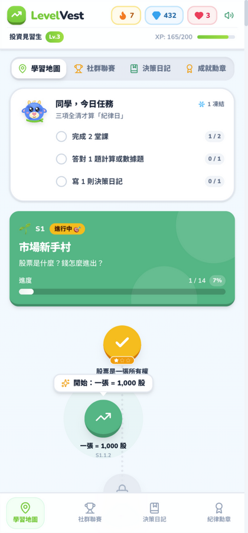
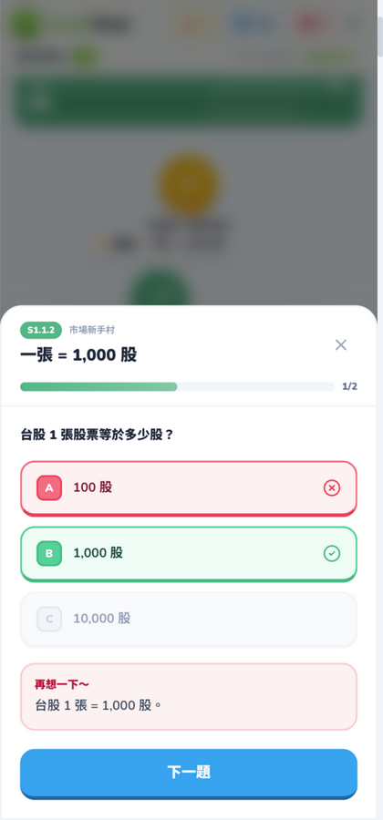
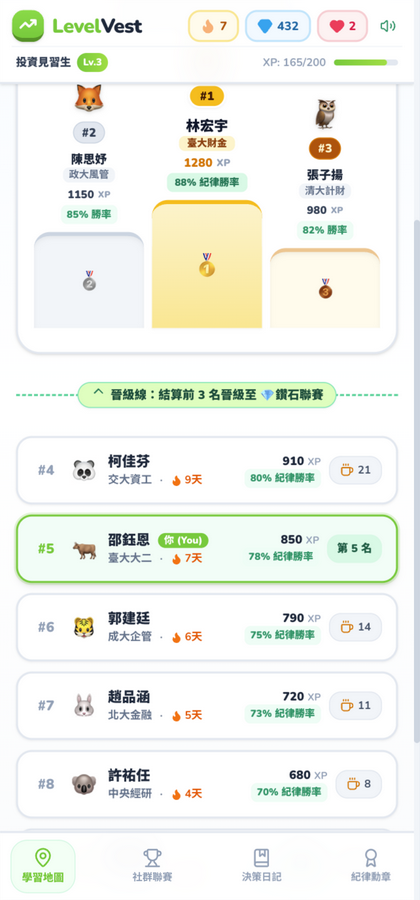
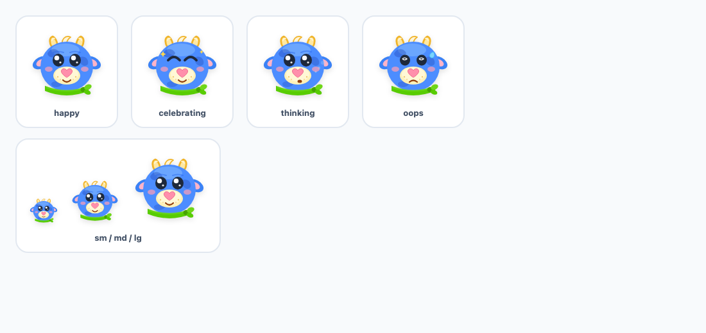
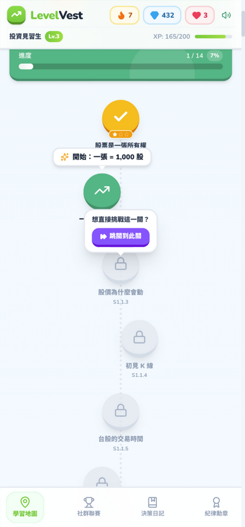
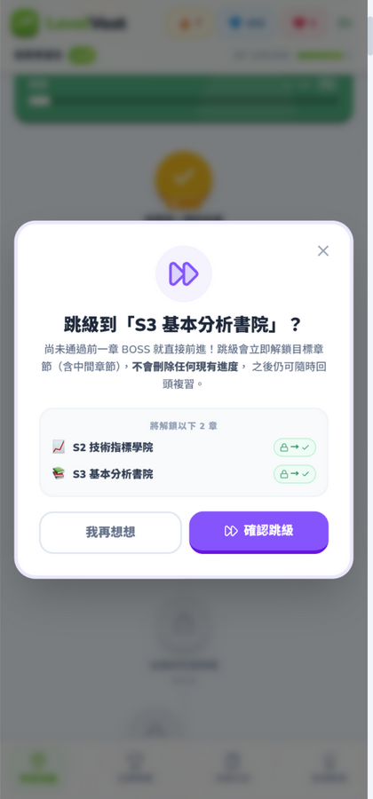
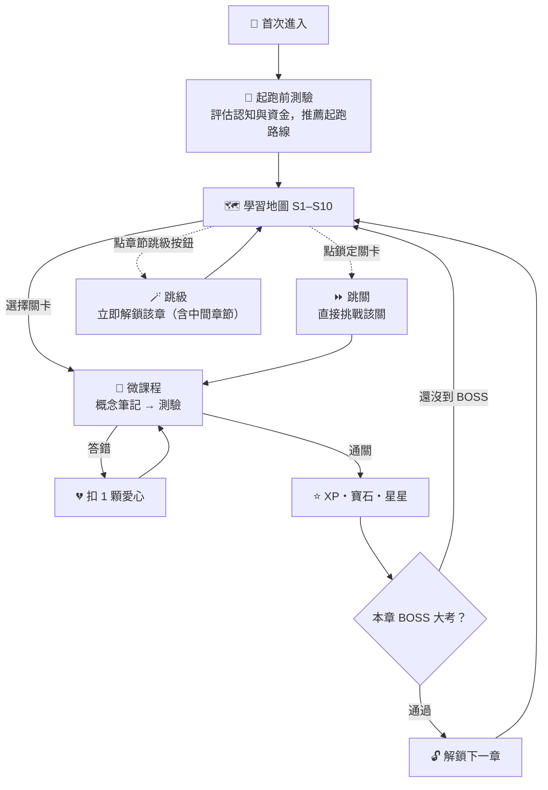

<div align="center">

# 📈 LevelVest

**投資理財的 Duolingo —— 遊戲化台股投資學習 App**

把台股知識變成一關一關的冒險：滑地圖、破 BOSS、賺寶石，
順便練出寫決策日記的好紀律。🐮

[](https://react.dev/)
[](https://www.typescriptlang.org/)
[](https://vite.dev/)
[](https://tailwindcss.com/)
[](https://ai.studio/apps/7783595c-84c6-4d57-ab9c-b10325139f56)

[🌐 線上課程藍圖](https://yu-0312.github.io/levelvest/curriculum-blueprint.html) · [⏩🪄 跳關 & 跳級](#skip) · [🧪 本地執行](#local-run)

</div>

<br />

## 📸 玩起來像這樣

| 🗺️ 學習地圖 | 📖 關卡測驗 | 🏆 社群聯賽 |
| :---: | :---: | :---: |
|  |  |  |
| Duolingo 式技能樹，過 BOSS 解鎖下一章 | 概念筆記 → 選擇題 → 星星結算 | 週 XP、紀律勝率、連勝天數 |

<br />

## ✨ 這是什麼？

LevelVest 是一款專為 **Gen Z 與投資新手**打造的遊戲化學習 App，用玩遊戲的方式學會台股基本功與投資紀律：

| | 特色 | 說明 |
| :---: | :--- | :--- |
| 🌳 | **技能樹關卡** | Duolingo 式地圖循序解鎖，10 章 126 關、每章一場 BOSS 大考，星星評級與互動測驗 |
| ⏩ | **跳關** | 覺得前面太簡單？點鎖定的關卡直接「跳關到此關」，前面的關卡會標記為已跳過 |
| 🪄 | **跳級** | 點章節卡片上的「跳級」按鈕，直接解鎖目標章節（含中間章節），進度保留、隨時回頭 |
| ❤️ | **愛心 / 寶石 / 等級** | 答錯扣愛心、過關賺 XP 與寶石，用寶石補血或讀蒙格心法免費 +1 心 |
| 📓 | **投資決策日記** | 記錄模擬操作（買進試單 / 逢高獲利 / 嚴格停損 / 空手觀望）＋情緒標記與紀律評分 |
| 🏅 | **行為金融徽章** | 「逆風冷靜者」「心魔獵人」等 8 枚徽章，鼓勵戰勝人性弱點 |
| 🏆 | **班級排行榜** | 週 XP、決策勝率、學習連勝，前 3 名晉級「鑽石聯賽」 |
| 🔊 | **音效回饋** | 點擊、成功、失誤、獲得寶石四種音效（Web Audio 合成，可關閉） |

教學內容涵蓋：什麼是股票與張/股、盤中零股交易、T+2 交割制度與違約交割風險、紅 K 綠 K、20MA 月線生命線等台股實戰主題。

> 🐮 陪練員「牛牛」會隨著情境變換表情：開心、思考、出錯時喊哎呀、破關時狂歡。
>
> 

<br />

<a id="skip"></a>

## ⏩🪄 跳關 & 跳級

不想從頭慢慢爬？兩種前進方式：

| | 跳關 ⏩ | 跳級 🪄 |
| :--- | :--- | :--- |
| **範圍** | 同一章內的單一關卡 | 整個章節（含中間所有章節） |
| **操作** | 點擊鎖定的關卡 →「跳關到此關」 | 點章節卡片上的「跳級」→ 確認彈窗 |
| **效果** | 前面未完成的關卡標記為**已跳過**（紫色 ⏩），直接從目標關開始 | 目標章節立即解鎖並標記**跳級入學 🪄**，現有進度與星星**完全不動** |
| **適合** | 已經會的觀念想快速通過 | 有經驗的投資人想直攻進階章節 |

| 點鎖定關卡 → 跳關 | 點章節卡片 → 跳級 |
| :---: | :---: |
|  |  |

> 💡 跳關 / 跳級**不會刪除任何內容**——被跳過的章節保持解鎖，之後隨時可以回頭補課。

<br />

## 🗺️ 學習地圖：10 章 · 126 關

| 章 | 主題 | 內容 | 關卡 |
| :---: | :--- | :--- | :---: |
| 🌱 S1 | **市場新手村** | 股票是什麼？錢怎麼進出？（開戶、張/股、T+2 交割、手續費） | 14 |
| 📈 S2 | **技術指標學院** | 圖怎麼看？趨勢怎麼認？（K 線、均線、KD、MACD、型態） | 17 |
| 📚 S3 | **基本分析書院** | 這家公司值多少錢？（三表、EPS、本益比、護城河） | 17 |
| 🥋 S4 | **下單實戰道場** | 各種單怎麼下？槓桿怎麼運作？（限價/市價、零股、融資融券） | 13 |
| 🛡️ S5 | **風險管理堡壘** | 怎麼讓自己活得夠久？（停損、部位控制、再平衡） | 10 |
| 🧠 S6 | **投資心理修煉場** | 為什麼我知道卻做不到？（損失趨避、FOMO、羊群效應） | 12 |
| 🏛️ S7 | **商品圖書館** | 除了個股還能買什麼？（ETF、債券、期權風險） | 13 |
| 🔭 S8 | **總體經濟瞭望塔** | 大環境怎麼影響持股？（景氣循環、利率、匯率） | 10 |
| 🔬 S9 | **進階研究館** | 怎麼做出自己的研究？（除權息、籌碼、估值） | 13 |
| 🎓 S10 | **大師試煉** | 我準備好用真錢了嗎？（90 天模擬盤、投資計畫書） | 7 |

📖 完整課程設計藍圖（10 章 / 38 單元 / 10 種題型 / 遊戲機制對照）→ [線上閱讀](https://yu-0312.github.io/levelvest/curriculum-blueprint.html) · [原始檔](public/curriculum-blueprint.html)

<br />

## 🧭 遊戲流程



<br />

<a id="local-run"></a>

## 🚀 本地執行

**需求**：Node.js 18+

```bash
git clone https://github.com/Yu-0312/levelvest.git
cd levelvest
npm install          # 若 peer dependency 衝突，改用：npm install --legacy-peer-deps
npm run dev          # 開發伺服器 → http://localhost:3000
```

其他指令：

```bash
npm run build        # 生產建置 → dist/
npm run preview      # 預覽建置結果
npm run lint         # TypeScript 型別檢查（tsc --noEmit）
```

> 💡 學習進度存在瀏覽器 localStorage（`levelvest-save-v1`）。想重新跑一次新手引導，在開發者工具執行 `localStorage.removeItem('levelvest-save-v1')` 後重新整理即可。

<br />

## ☁️ 部署

本專案最初在 [Google AI Studio](https://ai.studio/apps/7783595c-84c6-4d57-ab9c-b10325139f56) 建立。可回到 AI Studio 的 Deploy 功能，或把 `dist/` 部署到任何靜態主機（Vercel / Netlify / Cloudflare Pages）。

<br />

## 🧱 技術架構

| 層 | 技術 |
|---|---|
| 前端框架 | React 19 + TypeScript |
| 建置工具 | Vite 8 |
| 樣式 | Tailwind CSS 4（`@tailwindcss/vite`） |
| 動畫 | Motion、canvas-confetti |
| 圖示 | lucide-react |
| 音效 | Web Audio API（`src/utils/audio.ts`） |

> **目前狀態**：前端原型。關卡、排行榜、日記資料來自 `src/data/` 的課程資料與 mock 資料；`package.json` 雖含 `@google/genai`，但程式碼尚未實際呼叫 Gemini API，`.env.example` 的 `GEMINI_API_KEY` 為 AI Studio 部署預留欄位。

<br />

## 📁 專案結構

```
levelvest/
├── src/
│   ├── components/
│   │   ├── SkillTree.tsx        # 學習地圖（跳關氣泡、跳級按鈕也在這）
│   │   ├── LessonPlayer.tsx     # 關卡播放器（筆記 → 測驗 → 結算）
│   │   ├── SkipGradeModal.tsx   # 跳級確認彈窗
│   │   ├── OnboardingSurvey.tsx # 起跑前測驗
│   │   ├── Leaderboard.tsx      # 社群聯賽
│   │   ├── TradeJournal.tsx     # 決策日記
│   │   ├── HeartRefillModal.tsx # 補血彈窗（寶石 / 蒙格心法）
│   │   └── …                    # Header、Mascot、DailyTasks、WisdomModal
│   ├── data/
│   │   ├── curriculumPart1.ts   # S1–S5 課程資料
│   │   ├── curriculumPart2.ts   # S6–S10 課程資料
│   │   └── mockData.ts          # 排行榜 / 徽章 / 任務初始資料
│   ├── utils/audio.ts           # Web Audio 音效合成
│   ├── types.ts                 # TypeScript 型別定義
│   ├── App.tsx                  # 主應用（4 個分頁 + 跳關/跳級邏輯）
│   └── index.css
├── docs/                        # README 截圖與 QA 素材
├── public/curriculum-blueprint.html
└── vite.config.ts
```

<br />

## 🛣️ Roadmap

- [x] 10 章主線課程與 BOSS 大考
- [x] 跳關（章內跳過個別關卡）
- [x] 跳級（直接解鎖目標章節）
- [ ] 接上 Gemini API：AI 出題與個人化錯題解析
- [ ] 真實排行榜後端（目前為班級 mock 資料）
- [ ] 錯題本與弱點補強推薦
- [ ] PWA 離線學習

<br />

## 🤝 貢獻

歡迎開 Issue 或 PR！課程內容集中在 `src/data/curriculumPart*.ts`，格式簡單——新增一關只需要一個 `lesson(...)` 呼叫。

<div align="center">

**僅供學習與展示用途。**
LevelVest 為投資教育產品，所有標的、數據與走勢皆為虛構範例，不構成投資建議或收益保證。

</div>
